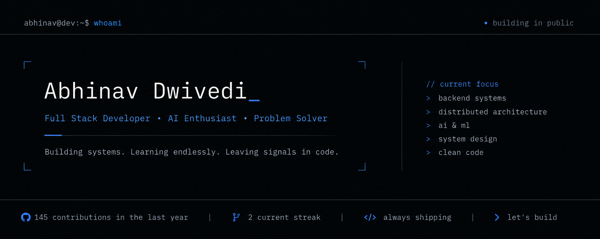

  

<h1 align="center">Abhinav Dwivedi</h1>

  <strong>Full Stack Developer • AI Enthusiast • Java & Spring Boot Developer</strong>

Building scalable backend systems, modern web applications, and AI-powered solutions.

  
  

<h1 align="center">Abhinav Dwivedi</h1>

  <strong>Full Stack Developer • AI Enthusiast • Java & Spring Boot Developer</strong>

Building scalable backend systems, modern web applications, and AI-powered solutions.

  
  

---

## About

- B.Tech Computer Science (AI & Full Stack), **UPES Dehradun** (2023–2027)
- CGPA: **8.4 / 10**
- Vice Chairman, **IEEE Computational Intelligence Society, UPES**
- Former **Web Developer Intern** at **Global Smart Investor LLP**
- Solved **190+ LeetCode Problems**
- Passionate about **Backend Engineering, AI, System Design, and Full Stack Development**
- Currently learning **Spring Boot, Microservices, Distributed Systems, and Advanced DSA**

---

## Tech Stack

### Languages

### Frontend

### Backend

### Databases

### Tools

---

## Featured Projects

### Campus Resource Optimization System

AI-powered platform for intelligent classroom allocation, timetable optimization, complaint management, and campus analytics.

**Stack:** React • FastAPI • MongoDB • Python

---

### Lost & Found Management System

Role-based Lost & Found platform built using Spring Boot and React.

**Stack:** Spring Boot • React • MySQL

---

### SkillSwap

Peer-to-peer skill exchange platform.

**Stack:** React • Node.js • MongoDB

---

### Student Feedback Portal

Feedback management platform for educational institutions.

**Stack:** Node.js • Express • MongoDB

---

## GitHub Statistics

  
  

  

---

## LeetCode

  

---

## Connect

  
  
  

---

<i>Building systems. Learning endlessly. Leaving signals in code.</i>

